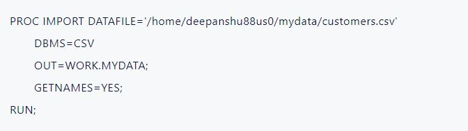
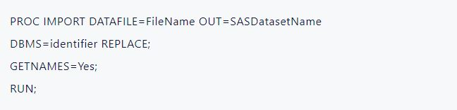
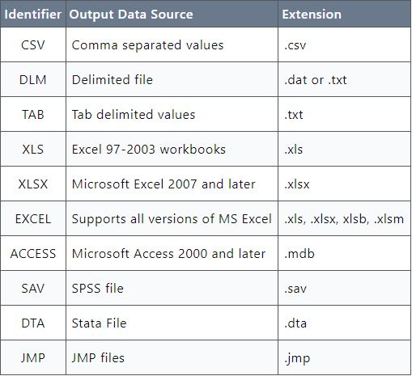
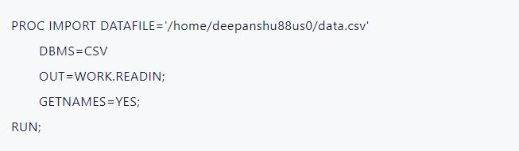
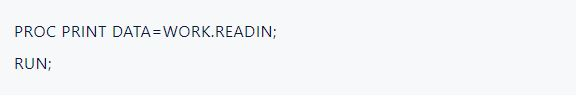
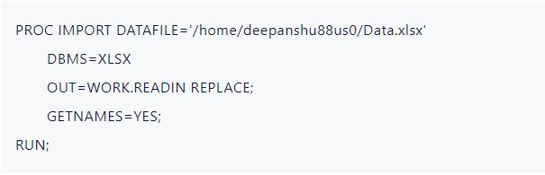
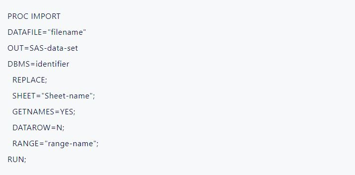
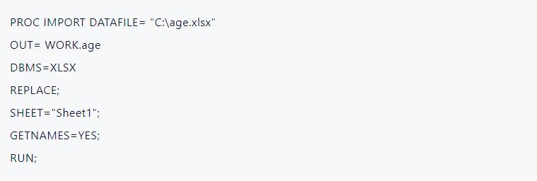
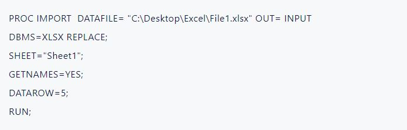

# SAS_Practice
Coursera: Getting Started with SAS Programming

## Repo Overview
This repo follows the Coursera Getting Started with SAS Programming course.
- https://www.coursera.org/learn/sas-programming-basics/home/welcome

SAS® OnDemand for Academics Dashboard
- https://welcome.oda.sas.com/home

Listendata Tutorial
- https://www.listendata.com/p/sas-tutorials.html

## Data Setup
For the initial data setup, I downloaded the zip file from coursera, and ran the SAS program CourseraStartupCode.SAS. Both are in the github repo.

## High-level look at the structure of SAS programs
A SAS program consists of a sequence of **steps**. Each step in the program performs a specific task. There are two kinds of steps in SAS programs: DATA steps and PROC or procedure steps. A SAS program can contain any combination of DATA steps and PROC steps depending on the tasks you want to perform. DATA and PROC steps get their name from the **key word** that begins the first statement in the step, DATA or Proc. Most apps end with a run statement, and a few PROC steps and with a quit statement. If you don't use a run statement at the end of a step, the beginning of a new DATA or PROC step signals the end of the previous step.

### What SAS Can Do
SAS Can:
- allow you to enter, retrieve, and manager your data easily
- read data from various external sources - Excel, CSV, Text Files, Databases, Webpages, etc.
- explore and manipulate data in SAS
- analyze your data statistically and mathematically. Includes various statistical techniques
- generate graphs and tables
- run SQL queries on SAS datasets
- automate repetitive tasks with SAS Macros
- develop new software applications

### DATA Steps
- Generally reads data from an input source, processes it, and creates a SAS table
- Might also filter rows, compute new columns, join tables, and perform other data manipulations

### PROC or Procedure Steps
- Process a SAS table in a specific a predefined wa
- Generate reports and graphs, managed data, or perform complex statistical analyses

### Statements
Each step consists of a sequence of **statements**, and most statements start with the **keyword** that's part of the SAS language. All statements must end with a semicolon.

Types of statements:
- Data statement
- Set statement
- Assignment statement
- Print statement
- Run statement
- Global statement 

Global statements typically define some option or setting for the SAS session. They can be outside of DATA and PROC steps, and do not need run statements.

## How to Import Data
### How to Upload Data to SAS Ondemand for Academics
Uploading files allows you to use files stored on your computer within the SAS program. The file can be in any format, and does not need to be in the SAS data file formate, .sas7bdat. 

To use a file saved on your computer, follow these two simple steps:
- First, upload the file to your SAS OnDemand for Academics account
- Second, import the uploaded file using either Import Data utility or PROC IMPORT procedure.

### Using the Import Data utility
1. Go to the desired folder where you want to import the file. It is located on the left-hand side of the screen under Server Files and Folders pane.
2. Right click on the folder and then click on Upload Files.
3. Click on Choose Files and then locate and select the file you want to import. Then click on Upload button
4. Once done, the file should be appeared in the folder you selected in step 1.
5. In the folder where file is imported, locate the imported datafile and then right click on it and select the Import Data option.
6. Click on the Run button to start importing.
7. SAS Studio will import the CSV file and create a new dataset. By default, the imported dataset will be available in the WORK library.

The Import Data utility automatically show the file information and generate SAS code for importing.

### Import Data using PROC IMPORT instead of Import Data utility
The basic syntax of PROC IMPORT is as follows. The following SAS code creates a SAS dataset named MYDATA in the temporary library called WORK.

## PROC IMPORT
PROC IMPORT is a powerful SAS procedure that allows you to import data from various external file formats into SAS datasets. It simplifies the process of importing data in SAS.

### Syntax: PROC IMPORT
Syntax of PROC IMPORT is defined below.

Arguments of PROC IMPORT : Explanation

1. DATAFILE: Specify the location of the file to be imported.
2. OUT: Specify the name to assign to the dataset after it is imported into SAS
3. DBMS: Define the format of the file being imported. Some of the common values are CSV, EXCEL, TAB, DLM, ACCESS.
4. REPLACE: Determine whether to replace the existing SAS Dataset. Yes/No.
5. GETNAMES: Specify whether to use the first row as variable names. By default it it YES. If you set the option as NO, it will tell SAS not to use the first row of data as variable names. In this case SAS assigns variable names as VAR1, VAR2, VAR3 if there are 3 variables.

### File Formats supported in PROC IMPORT
Following is a list of file extensions supported in PROC IMPORT. Specify the value in DBMS=identifier option

### Use PROC IMPORT to Import CSV Files
A simple example to import a CSV file into SAS.

The above SAS Program creates a SAS dataset named READIN in the temporary library (WORK). DBMS=CSV tells SAS that the file being imported is a CSV file. To see the imported file in RESULTS window, you can use PROC PRINT procedure. See the SAS program below.

DBMS=XLSX informs SAS that the file being imported is a MS Excel file (with .xlsx extension).

Additional Options in PROC IMPORT to Import Excel File

### Use PROC IMPORT to import an Excel File
In the example below we are importing Excel file in SAS.

DBMS=XLSX informs SAS that the file being imported is a MS Excel file (with .xlsx extension).

Additional Options in PROC IMPORT to Import Excel File

- SHEET: Specify the name of the sheet in the Excel file from which you want to import data. When you use PROC IMPORT without explicitly mentioning the SHEET option, SAS will automatically import the first sheet of the Excel file by default. If you want to import a specific sheet, you need to explicitly specify the sheet name.
- DATAROW: Specify the row number from which you want SAS to import data. If GETNAMES=YES, the DATAROW value must be greater than or equal to 2. If GETNAMES=NO, the DATAROW value must be greater than or equal to 1.
- RANGE: Specify the range of Excel file. For e.g. RANGE="Sheet1$A1:D50"

### Use PROC IMPORT to Import Delimited File, SPSS Files, etc.
For more information on importing delimited files, and SPSS files, etc., check out https://www.listendata.com/2023/05/proc-import.html, or search google.

## Importing EXCEL Data into SAS
PROC IMPORT is the SAS procedure used to read data from excel into SAS. This section goes more in-depth on how to import excel data to SAS with PROC IMPORT.

### PROC IMPORT Syntax

1. DATAFILE=option tells SAS where to find the Excel file that you want to import (Complete filename path). For example : DATAFILE = "C:\Desktop\age.xlsx"
- Note: Using SAS OnDemand for Academics follows different steps, syntax.
2. OUT= option tells SAS to create a dataset with any name of your choice. By default, the imported dataset is saved on WORK library (temporary library)
- Examples :
- OUT = Age . In this statement, PROC IMPORT uses the WORK library and dataset name is Age. Please note that OUT = Age is equivalent to OUT = Work.Age .
- OUT = Input.Age In this statement, PROC IMPORT uses the Input library (Permanent library).
3. DBMS=option tells SAS the type of file to read.
Examples :
- DBMS = XLS for Excel 97-2003 workbooks
- DBMS = XLSX for Excel 2007 and above workbooks
4. SHEET= option is used to specify which sheet SAS would import.
- Examples :
- SHEET = "Sheet1" - To import data from worksheet named sheet1.
- SHEET = "Goal" - To import data from worksheet named Goal.
5. GETNAMES= YES tells SAS to use the first row of data as variable names.
- By default, PROC IMPORT uses GETNAMES= YES. If you type GETNAMES= NO, SAS would not read variable names from first row of the sheet.
6. DATAROW= option is used to specify starting row from where SAS would import the data.
- For example : DATAROW =5 tells SAS to start reading data from row number 5.
- Note :
- i. When GETNAMES=YES, DATAROW must be greater than or equal to 2
- ii. When GETNAMES=NO, DATAROW must be greater than or equal to 1
7. RANGE= option is used to specify which range SAS would import.
- Examples :
- i. RANGE="Sheet1$B2:D10"
- This would tell SAS to import data from range B2:D10 from sheet1
- ii. RANGE="Information"
- This would tell SAS to import data from excel defined name range. In the example shown above, it is Information.

## Examples Excel File Imports into SAS

1. DATAFILE= "C:\age.xlsx" tells SAS where to find the Excel file that you want to import. Use XLS for MS Excel 97-2003
2. Note: In SAS Studio, DATAFILE = "/home/username/age.xlsx"
3. OUT= WORK.age tells SAS to create a dataset named age stored in WORK library
4. DBMS= XLSX tells SAS the XLSX (Excel 2007 and above) format file to read.
5. REPLACE is used to overwrite the age dataset if it exists already.
6. SHEET= "Sheet1" tells SAS to import data from Sheet1.
7. GETNAMES="YES" tells SAS to use the first row of data as variable names.

### Importing an excel file from specified row

