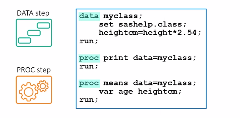
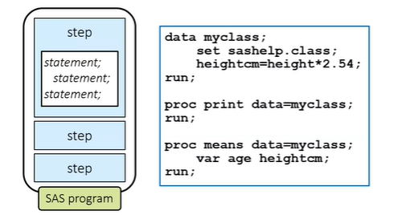
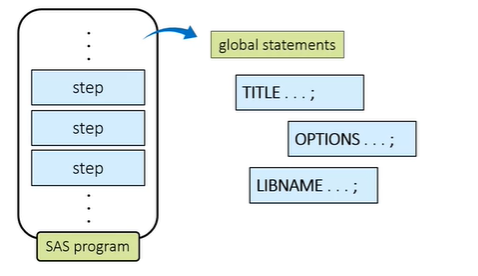
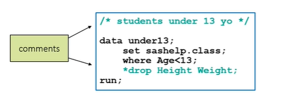

# SAS_Practice
Coursera: Getting Started with SAS Programming

## Repo Overview
This repo follows the Coursera Getting Started with SAS Programming course.
- https://www.coursera.org/learn/sas-programming-basics/home/welcome

SAS® OnDemand for Academics Dashboard
- https://welcome.oda.sas.com/home

## Data Setup
For the initial data setup, I downloaded the zip file from coursera, and ran the SAS program CourseraStartupCode.SAS. Both are in the github repo.

## High-level look at the structure of SAS programs
A SAS program consists of a sequence of **steps**. Each step in the program performs a specific task. There are two kinds of steps in SAS programs: DATA steps and PROC or procedure steps. A SAS program can contain any combination of DATA steps and PROC steps depending on the tasks you want to perform. DATA and PROC steps get their name from the **key word** that begins the first statement in the step, DATA or Proc. Most apps end with a run statement, and a few PROC steps and with a quit statement. If you don't use a run statement at the end of a step, the beginning of a new DATA or PROC step signals the end of the previous step.

### DATA Steps
- Generally reads data from an input source, processes it, and creates a SAS table
- Might also filter rows, compute new columns, join tables, and perform other data manipulations

### PROC or Procedure Steps
- Process a SAS table in a specific a predefined wa
- Generate reports and graphs, managed data, or perform complex statistical analyses

### Statements
Each step consists of a sequence of **statements**, and most statements start with the **keyword** that's part of the SAS language. All statements must end with a semicolon.

Types of statements:
- Data statement
- Set statement
- Assignment statement
- Print statement
- Run statement
- Global statement 

Global statements typically define some option or setting for the SAS session. They can be outside of DATA and PROC steps, and do not need run statements.

### List of Keywords
- Data
- set
- run

## SAS Program Syntax
- SAS tools in the program editor that format code for you
- You can type unquoted values such as columns, table names or keywords in any case

### Comments
- Ignored when the program executes
- Use comments to document code or suppress a portion of code from executing
- To comment out a single statement ending in a semicolon, you add an asterisk at the beginning of the statement
- To comment out multiple lines of code, you add slash asterisk at the beginning and asterisk slash at the end of the text you want to comment out.

